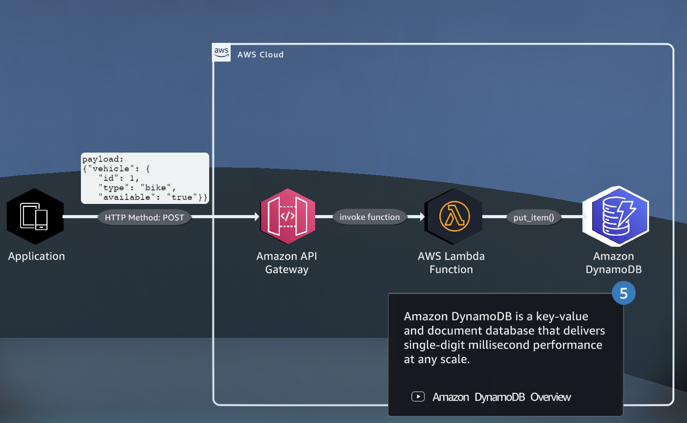
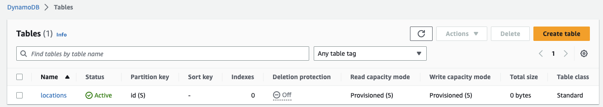
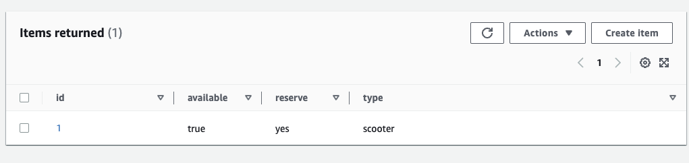
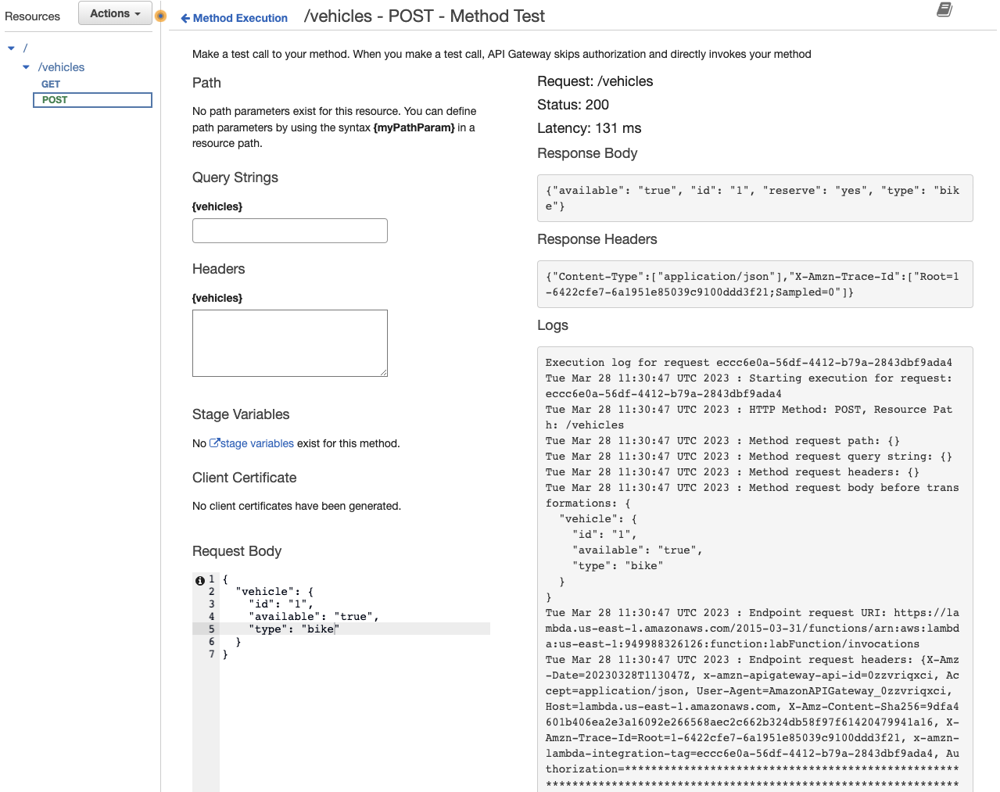
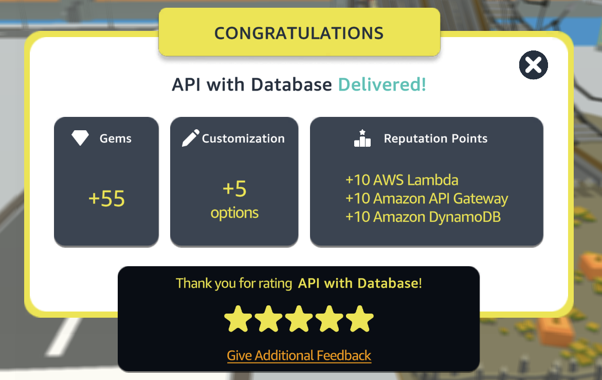

# API with Database

[](https://docs.aws.amazon.com/quicksight/latest/user/signing-up.html)
[](https://aws.amazon.com/route53/)
[](https://aws.amazon.com/ec2/)
[](https://aws.amazon.com/vpc/)


This project is aimed at providing a simple guide to creating a Restful API using Amazon API Gateway and DynamoDB. By the end of this project, you will be able to:

- Create an Amazon DynamoDB table to store vehicle data
- Create an AWS Lambda function to save records in Amazon DynamoDB
- Create a Rest API using Amazon API Gateway

<p align="center">
  
</p>

## Table of Contents

- [Requirements](#requirements)
- [Steps](#Steps)
- [Conclusion](#conclusion)
- [Contributors](#contributors)


## Requirements
To complete this quest, you will need an AWS account with access to the following services:
- Amazon Lambda Function
- Amazon API Gateway
- Amazon DynamoDB

##Steps
### Step 1: Creating an Amazon DynamoDB table
Amazon DynamoDB is a fast and flexible NoSQL database service provided by AWS. Follow the steps below to create an Amazon DynamoDB table:

1. Log in to your AWS Management Console and navigate to the DynamoDB dashboard.
2. Click on the "Create Table" button.
3. Enter a name for your table and the primary key for your table. The primary key is used to uniquely identify each item in the table.
4. Once you have entered the required information, click on the "Create" button.

<p align="center">
  
</p>


### Step 2: Creating an AWS Lambda function
AWS Lambda is a compute service that runs your code in response to events and automatically manages the compute resources for you. Follow the steps below to create an AWS Lambda function:

1. Log in to your AWS Management Console and navigate to the AWS Lambda dashboard.
2. Click on the "Create Function" button.
3. Choose the "Author from Scratch" option.
4. Enter a name for your function and select the programming language of your choice.
5. Under "Permissions", select "Choose or create an execution role" and choose a basic execution role.
6. Once you have entered the required information, click on the "Create Function" button.
7. In the "Function code" section, write the code to save records in Amazon DynamoDB.

``` python
import boto3
from botocore.exceptions import ClientError
from boto3.dynamodb.conditions import Key
import logging
import json

# AWS Lambda Function Logging in Python - https://docs.aws.amazon.com/lambda/latest/dg/python-logging.html
logger = logging.getLogger()
logger.setLevel(logging.INFO)


session = boto3.Session()
# Boto3 - DynamoDB - https://boto3.amazonaws.com/v1/documentation/api/latest/reference/services/dynamodb.html
dynamodb = session.resource("dynamodb")

###Lab Note: Change below to the new table name created for the DIY section.
table_name = "locations"

table = dynamodb.Table(table_name)

# DynamoDB create item in table logic
def create_item(item):
    try:
        ret = table.put_item(Item=item);
        logger.info({"operation": "create an item", "details": ret});
        
    except ClientError as err:
        print(err);
        logger.debug({"operation": "item creation", "details": err});
        

# DynamoDB update Item from table logic
def update_item(item, reserve):
    try:
        ret = table.update_item(
            Key={
                'id': item["id"]
            },
            UpdateExpression="set reserve = :ad",
            ExpressionAttributeValues={
                ':ad': reserve
            },
            ReturnValues="UPDATED_NEW"
        )
        logger.info({"operation": "update an item ", "details": ret});
        
    except ClientError as err:
        logger.debug({"operation": "item update", "details": err});

# DynamoDB get Item from table logic
def get_item(id):
    try:
        ret = table.get_item(
            Key={ 'id': id }
        )
        logger.info({"operation": "query an item ", "details": ret});
        # Return the Item - https://boto3.amazonaws.com/v1/documentation/api/latest/reference/services/dynamodb.html#DynamoDB.Client.get_item
        return ret['Item'];
    except ClientError as err:
        logger.debug({"operation": "item query", "details": err});
    
    
# function to handle API Gateway Lambda proxy integration event and pass DIY validation
def api_gateway_handler(event):
    body = json.loads(event['body'])
    item = body['vehicle']
    item_id = item['id']
    
    create_item(item)
    update_item(item,"yes")
    
    ret = get_item(item_id)
    
    api_gateway_return = {
        'statusCode': '200',
        'body' : json.dumps(ret),
        'headers': {
            'Content-Type': 'application/json',
        }
    }
    
    return api_gateway_return
    
# Function to handle Lambda Local Test
def local_test_handler(event):
    item = event['vehicle']  

    item_id = item['id']
    create_item(item)
    update_item(item,"yes")
        
    ret = get_item(item_id)
        
    # Uncomment the code above to print the return 
    # print("Return: " + json.dumps(ret, indent=2))
    
    return ret


def lambda_handler(event, context):

    # Uncomment bellow line to inspect events at CloudWatch
    logger.info(event)


    # Function will first try to use the api-gateway-handler, if it fails it will default to trying the local test event.
    try:
        ret = api_gateway_handler(event)
    except:
        ret = local_test_handler(event)    

    return ret

```


Now Dynamo conatins this row: 

<p align="center">
  
</p>


### Step 3:Creating a Rest API using Amazon API Gateway
Amazon API Gateway is a fully managed service that makes it easy for developers to create, publish, maintain, monitor, and secure APIs at any scale. Follow the steps below to create a Rest API using Amazon API Gateway:

1.Log in to your AWS Management Console and navigate to the Amazon API Gateway dashboard.
2. Click on the "Create API" button.
3. Select the "REST API" option.
4. Choose the "New API" option and enter a name for your API.
5. Click on the "Create API" button.
6. Click on the "Actions" button and select the "Create Resource" option.
7. Enter a name for your resource and click on the "Create Resource" button.
8. Click on the "Actions" button again and select the "Create Method" option.
9. Choose the HTTP method you want to use for your API and select the "Lambda Function" integration type.
10. Enter the ARN of the Lambda function you created earlier and click on the "Save" button.
11. Deploy your API to make it available to users.

<p align="center">
  
</p>


## Conclusion
By following the steps outlined above, you should now have a working Restful API that saves records in Amazon DynamoDB. This project provides a solid foundation for building more complex applications using AWS services.

<p align="center">
  
</p>

## Contributors

[Daniele Bocchino](https://danielebocchino.github.io/)

[](https://github.com/DanieleBocchino)  
[](https://www.linkedin.com/in/daniele-bocchino-aa602a20b/)
