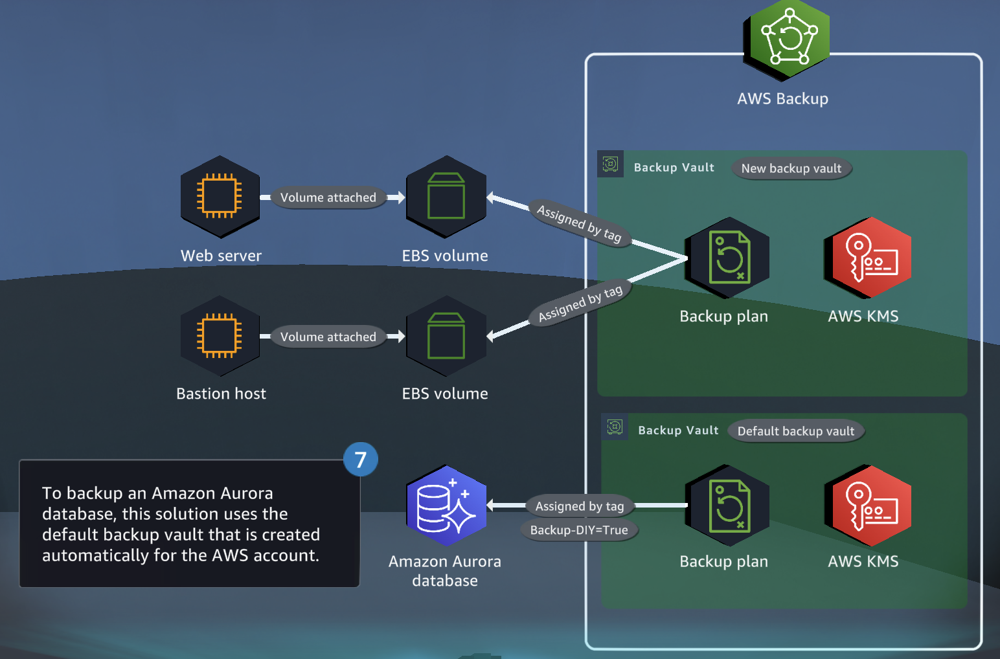
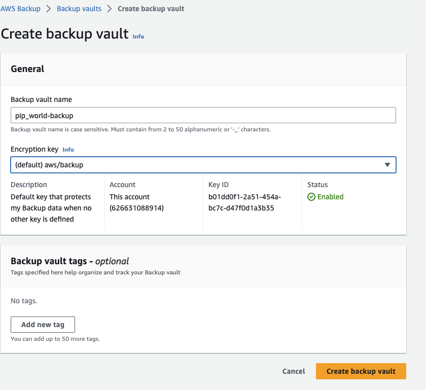
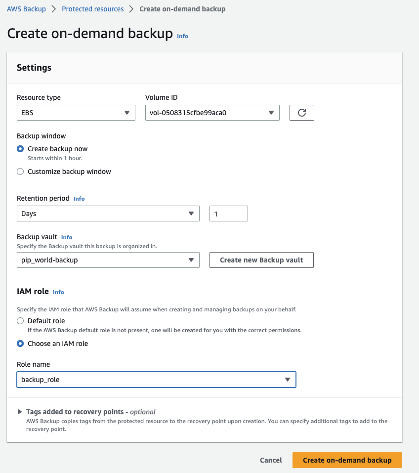
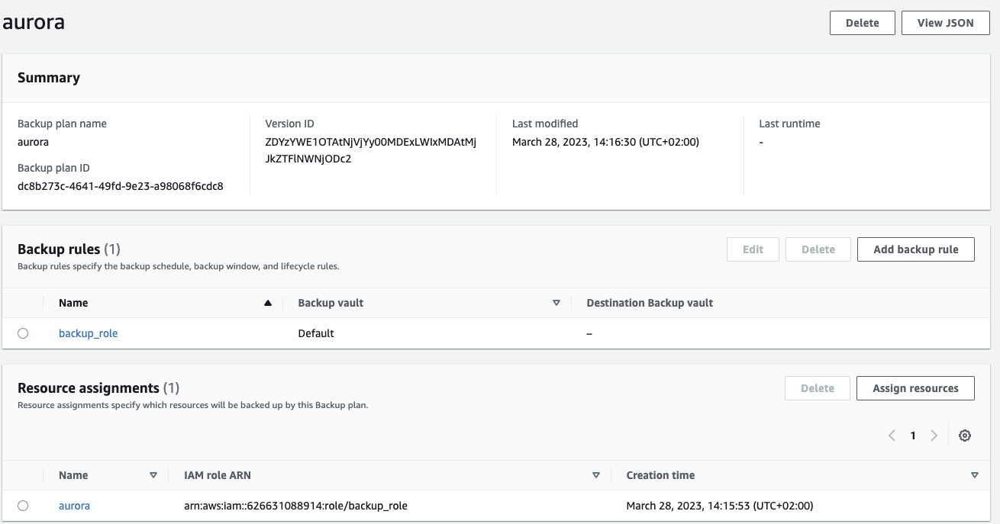
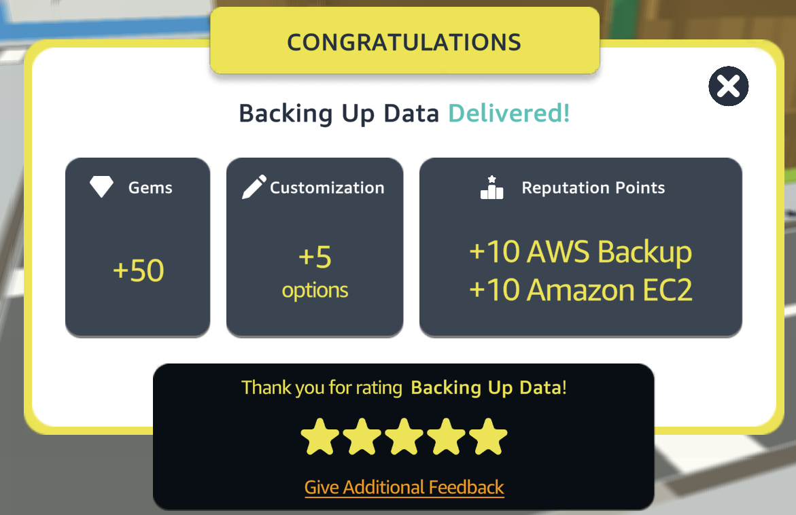

# API with Database

This repository contains scripts and configuration files for backing up data on AWS using various services such as Amazon EBS volumes and Aurora Serverless clustering.

  

## Table of Contents

- [Requirements](#requirements)
- [Steps](#Steps)
- [Conclusion](#conclusion)
- [Contributors](#contributors)

## Requirements
To complete this quest, you will need an AWS account with access to the following services:
- Amazon Aurora Serverless 
- Amazon Backup
- Amazon KMS
- Amazon EBS
- Amazon EC2

## Steps
### Step 1: Create a custom backup vault

  

### Step 2:Creating a backup plans
Create automated backup plans for EC2 attached Amazon EBS volumes using tags

  

### Step 3:Configure an AWS backup plan for an Amazon Aurora
Configure an AWS backup plan for an Amazon Aurora Serverless clustering by using the default backup vault

Assign the Aurora Serverless cluster as a resource by using the tag "Backup-DIY" = "TRUE"

  

## Conclusion
In conclusion, backing up your data is essential to ensure its safety and continuity in the event of an unexpected event. AWS provides multiple solutions for backing up your data, including creating a custom backup vault, configuring automated backup plans, and using tags to manage resources. With the knowledge gained from this guide, you can now confidently create and manage backup solutions for your AWS resources, ensuring that your data is always protected and available. Remember to regularly review and test your backup plans to ensure their effectiveness and make any necessary adjustments.

  

## Contributors

[Daniele Bocchino](https://danielebocchino.github.io/)

  

