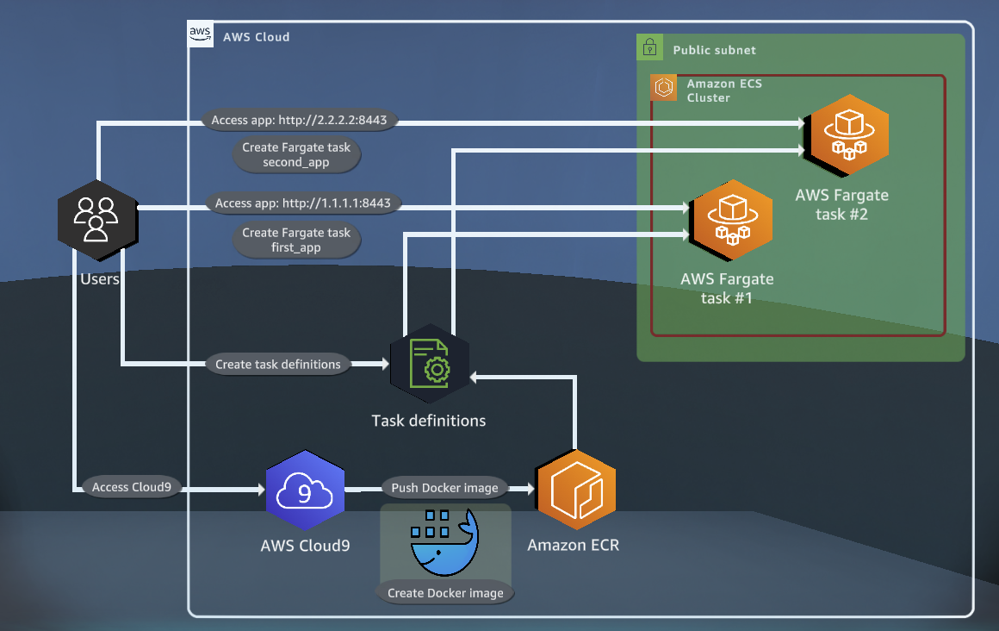
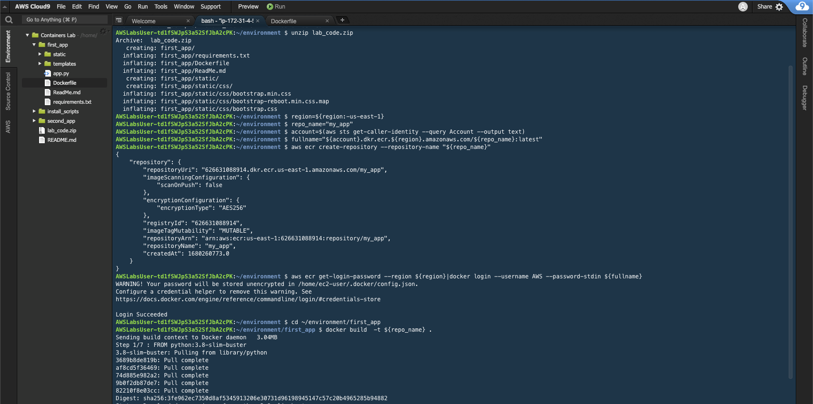
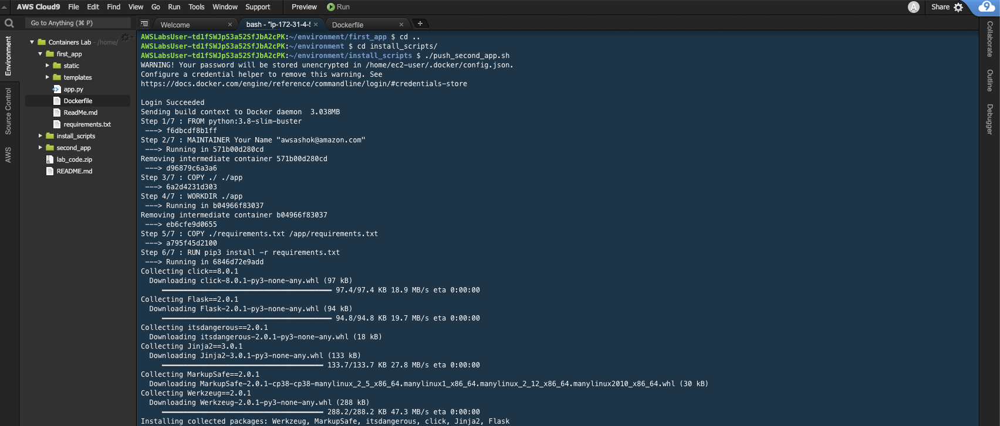
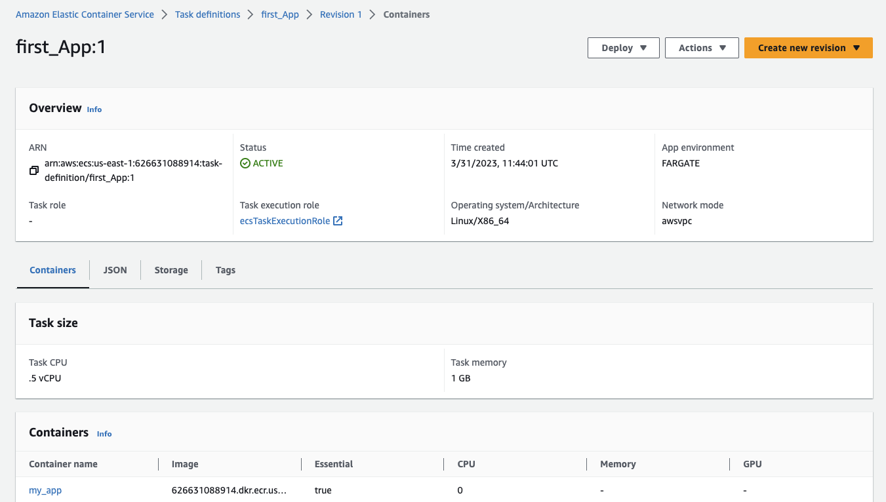
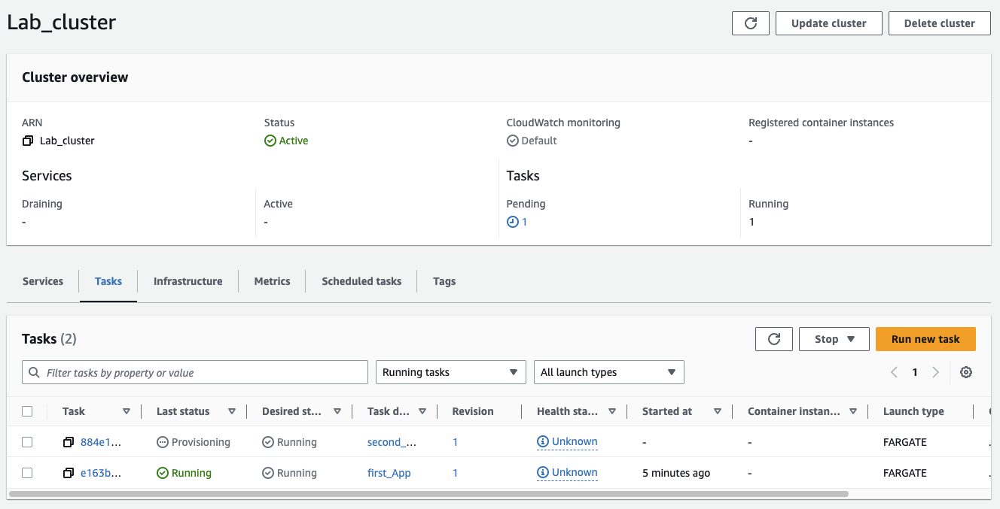
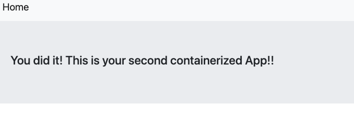
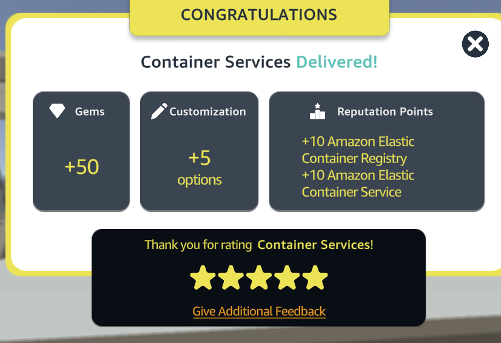

# Container Services

[](https://docs.aws.amazon.com/quicksight/latest/user/signing-up.html)
[](https://aws.amazon.com/ecs/)
[](https://aws.amazon.com/ecr/)
[](https://aws.amazon.com/fargate/)
[](https://aws.amazon.com/cloud9/)


This AWS Quest will guide you through creating a Docker image for an application, creating an ECR repository and pushing the Docker image to it, and deploying the application with ECS and Fargate using the image from Amazon ECR. You will also deploy a second application called my_second_app using Fargate by using the image from Amazon ECR and validate access to the second application.

<p align="center">
  
</p>

## Table of Contents

- [Requirements](#requirements)
- [Steps](#Steps)
- [Conclusion](#conclusion)
- [Contributors](#contributors)

## Requirements

To complete this quest, you will need an AWS account with access to the following services:

- Amazon ECR
- Amazon ECS
- Amazon Fargate
- Amazon Cloud9

## Steps

This quest consists of the following tasks :

- Create an Amazon SQS queue
- Create an Amazon SNS topic
- Subscribe the Amazon SQS queue to the Amazon SNS topic
- Create an additional SQS queue and subscribe it to your existing SNS topic

### Step 1: Unzip Docker Image

The first step is to create an Amazon SNS topic. SNS is a fully managed pub/sub messaging service that enables the decoupling of microservices and distributed systems. Follow these steps:

1. Open the Amazon Cloud9
2. Upload lab_files.zip to the Cloud9 environment.
3. Unzip the file using the following command:

```bash
unzip lab_files.zip
```

3. install docket image using the following command:

```bash
/install_scripts/install_docker.sh
```

- To get the value of the Region, at the command prompt, run:

```bash
region=${region:-us-east-1}
```

- To create a repository name, run the following commands one at a time:

```bash
repo_name="my_app"

account=$(aws sts get-caller-identity --query Account --output text)

fullname="${account}.dkr.ecr.${region}.amazonaws.com/${repo_name}:latest"
```

- To create an Amazon ECR repository, run:

```bash
aws ecr create-repository --repository-name "${repo_name}"
```

- To retrieve an authentication token, run:

```bash
aws ecr get-login-password --region ${region}|docker login --username AWS --password-stdin ${fullname}
```

- To create, build, and tag Docker images locally, run the following commands one at a time:

```bash
cd ~/environment/first_app
docker build  -t ${repo_name} .
```

<p align="center">
  
</p>

### Step 2: Build second app

The next step is to psuh second app on ECR. Follow these steps:

- To compile and push the image of the second_app to Amazon ECR, run the following commands one at a time.

```bash
cd ~/environment/install_scripts/
./push_second_app.sh
```

- The push_second_app.sh shell script creates the my_second_app image in Amazon ECR.

<p align="center">
  
</p>

### Step 3: Deploy first app

The next step is to deploy the application with ECS and Fargate using the image from Amazon ECR. To deploy the application, follow these steps:

1. Go to the Amazon ECS console and click on "Create cluster". Choose the "Fargate" launch type, and follow the prompts to create a new cluster.
2. Click on "Create task definition". Choose "Fargate" launch type, and select "ecsTaskExecutionRole" for the task role. Under "Container definitions", click on "Add container". Give the container a name, and under "Image", enter the ECR repository URI for the Docker image. Click on "Add".
3. Follow the prompts to create the task definition.
4. Click on "Create service". Choose the task definition created in the previous step, and follow the prompts to create a new service.

<p align="center">
  
</p>

### Step 4: Deploy second app

The final step is to deploy the second application called my_second_app using Fargate by using the image from Amazon ECR and validate access to the second application. To deploy the second application, follow these steps:

1. Create a new task definition for the second application using the same steps as in Step 3, but with the appropriate ECR repository URI for the Docker image.
2. Click on "Create service". Choose the task definition created in the previous step, and follow the prompts to create a new service

<p align="center">
  
</p>

<p align="center">
  
</p>


## Conclusion

The Decoupling Application quest of AWS is a valuable resource for developers looking to build highly scalable and decoupled applications. By learning how to create Amazon SQS queues, SNS topics, and subscriptions, developers can build resilient and fault-tolerant systems that can scale to meet increasing demand. The skills learned in this quest can be applied to a wide variety of use cases, from simple message queuing systems to complex distributed applications. With the knowledge gained from this quest, developers can create efficient and reliable applications that can adapt to changing business needs and user demands.

<p align="center">
  
</p>

## Contributors

[Daniele Bocchino](https://danielebocchino.github.io/)

[](https://github.com/DanieleBocchino)  
[](https://www.linkedin.com/in/daniele-bocchino-aa602a20b/)
