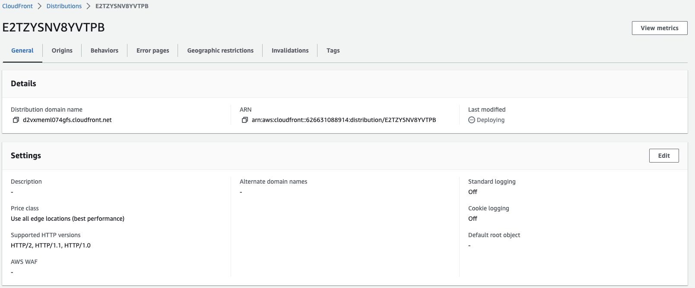

# Content Delivery Networks Quest with AWS CloudFront

This AWS CloudFront quest is designed to help you learn how to set up a Content Delivery Network (CDN) using Amazon CloudFront. By the end of this quest, you will be able to configure an Amazon EC2 instance or an S3 Hosted website as an origin for a CloudFront distribution.

  

## Table of Contents

- [Requirements](#requirements)
- [Steps](#Steps)
- [Conclusion](#conclusion)
- [Contributors](#contributors)

  

## Requirements
To complete this quest, you will need an AWS account with access to the following services:
- Amazon CloudFront
- Amazon EC2
- Amazon S3

## Steps
This quest consists of the following steps:

- Set up an Amazon EC2 instance as an origin for a CloudFront distribution.
- Configure an Amazon S3 hosted website as an origin for a CloudFront distribution.
- Reconfigure a CloudFront distribution to use an Amazon S3 website as the origin with index.html as the main page.

### Step 1: Set up an Amazon EC2 instance as an origin for a CloudFront distribution
In this step, you will set up an Amazon EC2 instance as an origin for a CloudFront distribution. You will learn how to:

1. Take ec2 instance 
2. Create a CloudFront distribution using the EC2 instance as the origin

  

### Step 2: Configure an Amazon S3 hosted website as an origin for a CloudFront distribution

In this step, you will configure an Amazon S3 hosted website as an origin for a CloudFront distribution. You will learn how to:

1. Create an S3 bucket to host a static website
2. Configure the bucket policy to allow public read access
3. Upload the website files to the S3 bucket
4. Configure the bucket properties to enable static website hosting
5. Create a CloudFront distribution using the S3 bucket as the origin

  

### Step 3: Reconfigure a CloudFront distribution to use an Amazon S3 website as the origin with index.html as the main page
In this step, you will reconfigure a CloudFront distribution to use an Amazon S3 website as the origin with index.html as the main page. You will learn how to:

1. Update the S3 bucket properties to use index.html as the main page
2. Configure the CloudFront distribution to use the updated S3 bucket as the origin

  

## Conclusion
By completing this AWS CloudFront quest, you will have learned how to set up a content delivery network using Amazon CloudFront and how to configure an Amazon EC2 instance or an Amazon S3 hosted website as an origin for a CloudFront distribution. You will also know how to reconfigure a CloudFront distribution to use an Amazon S3 website as the origin with index.html as the main page.

  

## Contributors

[Daniele Bocchino](https://danielebocchino.github.io/)

  

