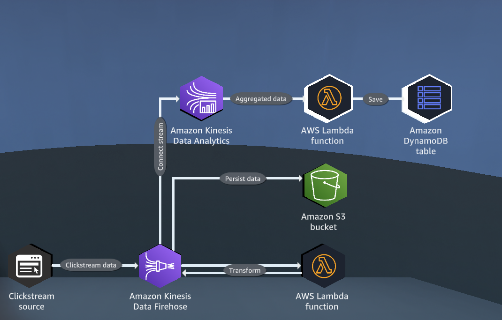
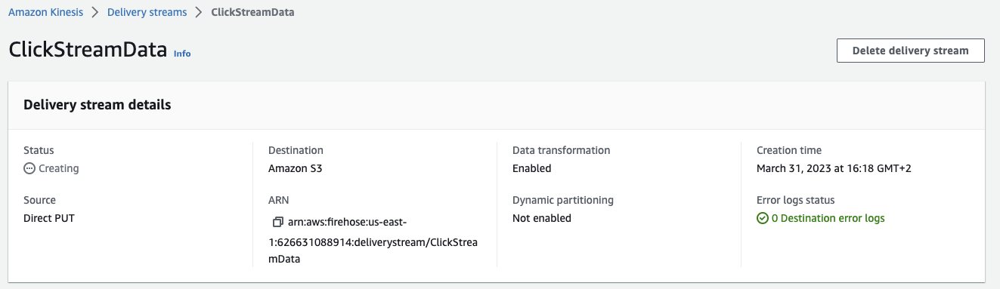
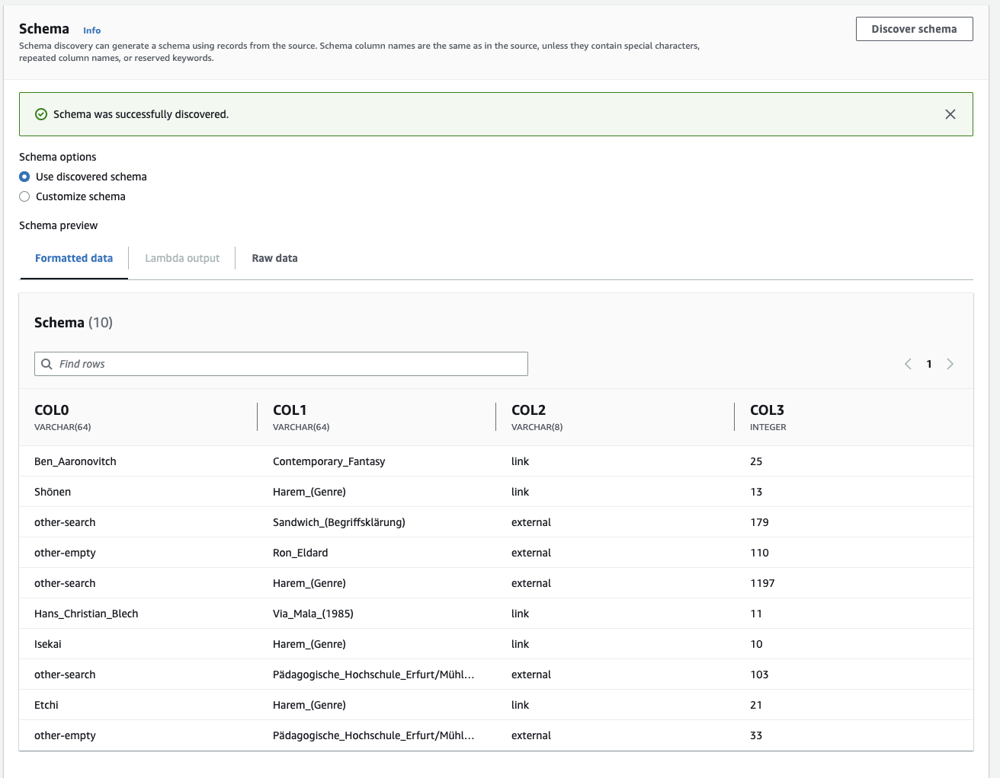
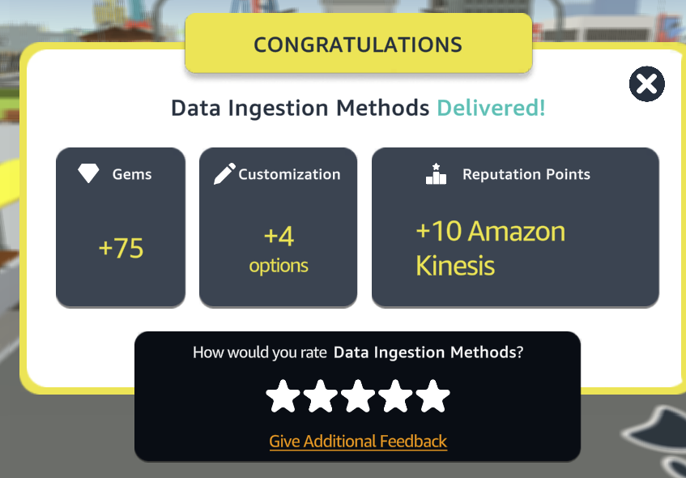

# Data Ingestion Methods

[](https://docs.aws.amazon.com/quicksight/latest/user/signing-up.html)
[](https://aws.amazon.com/dynamodb/)
[](https://aws.amazon.com/kinesis/firehose/)
[](https://aws.amazon.com/s3/)
[](https://aws.amazon.com/lambda/)
## OVERVIEW

This practice lab provides an overview of how to ingest and preprocess clickstream data using Amazon Kinesis Data Firehose, Amazon S3, AWS Lambda, and Amazon Kinesis Data Analytics. The lab objectives are as follows:

Create an Amazon Kinesis Data Firehose delivery stream.
Ingest and store clickstream data in an Amazon S3 bucket.
Use Amazon Kinesis Data Analytics to preprocess data with AWS Lambda.
Configure real-time analytics to count active page views.
Configure a Kinesis Data Analytics application to send real-time analytics results to an AWS Lambda function that populates a DynamoDB table.

<p align="center">
  
</p>

## Table of Contents

- [Requirements](#requirements)
- [Steps](#Steps)
- [Conclusion](#conclusion)
- [Contributors](#contributors)

## Requirements

To complete this quest, you will need access to the following AWS services:

- Amazon Kinesis Data Firehose
- Amazon S3
- Amazon Kinesis Data Analytics
- AWS Lambda
- Amazon DynamoDB

## Steps

### Step 1: Create a Kinesis Data Firehose delivery stream

1. Open the Kinesis Data Firehose console.
2. Click Create delivery stream.
3. In the Create delivery stream wizard, enter a name for your delivery stream (e.g., ClickStreamData).
4. Choose Direct PUT or other sources as the source.
5. Choose Amazon S3 as the destination.
6. Configure the destination S3 bucket, prefix, and compression options.
7. Review and confirm the settings, then create the delivery stream.

<p align="center">
  
</p>

### Step 2: Ingest clickstream data into S3

1. In the Kinesis Data Firehose console, select your delivery stream.
1. Click Test with demo data to generate sample data.
1. Review and confirm the data transformation settings, then click Next.
1. Choose the delivery stream you created in Step 1 as the destination.
1. Review and confirm the settings, then click Send test event to ingest the data into S3.

### Step 3: Preprocess data with Lambda and Kinesis Data Analytics

Open the AWS Lambda console.

Click Create function and choose Author from scratch.

Enter a name for your function (e.g., PreprocessClickstreamData) and choose Python 3.9 as the runtime.

Copy and paste the following code into the editor:

bash

```python
# Creating a Lambda package with runtime dependencies
# https://docs.aws.amazon.com/lambda/latest/dg/python-package-create.html#python-package-create-with-dependency
from datetime import datetime
import pandas as pd
import boto3
import os
import base64


s3 = boto3.client('s3')
data_bucket = os.environ.get('DATA_BUCKET_NAME')


def handler(event, context):
    """Example delivery stream record event
    {
        "invocationId":"00540a87-5050-496a-84e4-e7d92bbaf5e2",
        "applicationArn":"arn:aws:kinesisanalytics:us-east-1:12345678911:application/lambda-test",
        "streamArn":"arn:aws:firehose:us-east-1:AAAAAAAAAAAA:deliverystream/lambda-test",
        "records":[
            {
                "recordId":"49572672223665514422805246926656954630972486059535892482",
                "data":"aGVsbG8gd29ybGQ=",
                "kinesisFirehoseRecordMetadata":{
                    "approximateArrivalTimestamp":1520280173
                }
            }
        ]
    }
    """

    """Example response format
    {
        "records": [
            {
                "recordId": "49572672223665514422805246926656954630972486059535892482",
                "result": "Ok",
                "data": "SEVMTE8gV09STEQ="
            }
        ]
    }
    """

    # Response will be a list of records.
    response = {
        "records": []
    }

    # Clickstream data labels.
    labels = ['prev', 'curr', 'type', 'n']

    # Iterate list of input records.
    for record in event.get('records'):
        records = []

        # Get data from Kinesis record.
        data = base64.b64decode(record.get('data')).decode('utf-8')

        # Split into lines.
        lines = data.split('\n')

        for line in lines:
            # Skip any empty lines.
            if line == "":
                continue

            try:
                cols = line.split('\t')
                records.append((cols[0], cols[1], cols[2], cols[3]))
            except:
                continue

        # Convert to data frame.
        df = pd.DataFrame.from_records(records, columns=labels)

        response['records'].append({
            "recordId": record['recordId'],
            "result": "Ok",
            "data": base64.b64encode(df.to_csv(header=False, index=False).encode('utf-8'))
        })

    return response

```

<p align="center">
  
</p>

### Step 4: Define a Kinesis Data Analytics SQL

The final step is to create an alarm for memory usage. Here are the steps to follow:


```SQL
-- Approximate distinct count  - Counts the number of distinct items in a stream using HyperLogLog.
-- Returns the approximate number of distinct items in a specified column over a tumbling window.
-- Note that when there are less or equal to 10,000 items in the window, the function returns exact count.
CREATE OR REPLACE STREAM DESTINATION_SQL_STREAM (NUMBER_OF_DISTINCT_ITEMS BIGINT);
CREATE OR REPLACE PUMP "STREAM_PUMP" AS INSERT INTO "DESTINATION_SQL_STREAM"
SELECT STREAM NUMBER_OF_DISTINCT_ITEMS FROM TABLE(COUNT_DISTINCT_ITEMS_TUMBLING(
  CURSOR(SELECT STREAM * FROM "SOURCE_SQL_STREAM_001"),
  'column1', -- name of column in single quotes
  60 -- tumbling window size in seconds
  )
);
  
  ```

## Conclusion

In conclusion, backing up your data is essential to ensure its safety and continuity in the event of an unexpected event. AWS provides multiple solutions for backing up your data, including creating a custom backup vault, configuring automated backup plans, and using tags to manage resources. With the knowledge gained from this guide, you can now confidently create and manage backup solutions for your AWS resources, ensuring that your data is always protected and available. Remember to regularly review and test your backup plans to ensure their effectiveness and make any necessary adjustments.

<p align="center">
  
</p>

## Contributors

[Daniele Bocchino](https://danielebocchino.github.io/)

[](https://github.com/DanieleBocchino)  
[](https://www.linkedin.com/in/daniele-bocchino-aa602a20b/)
