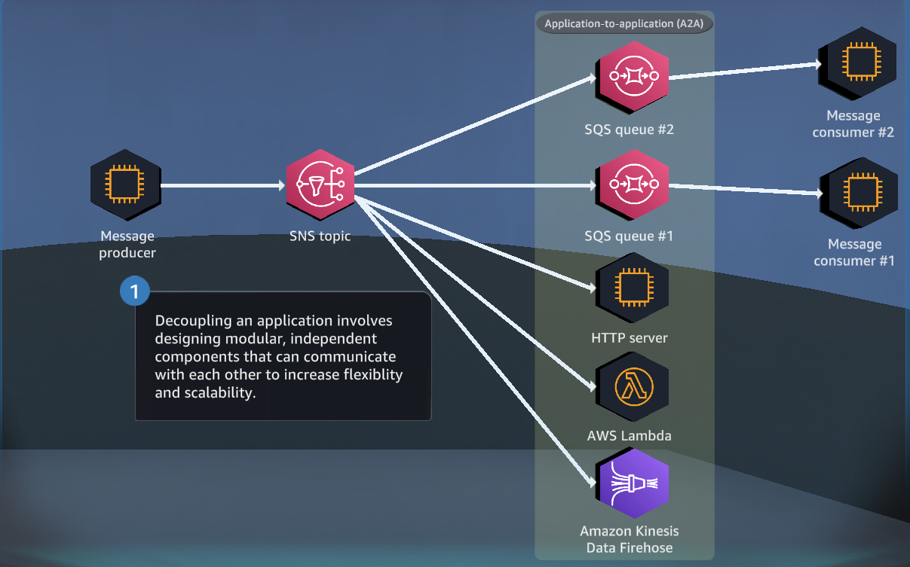
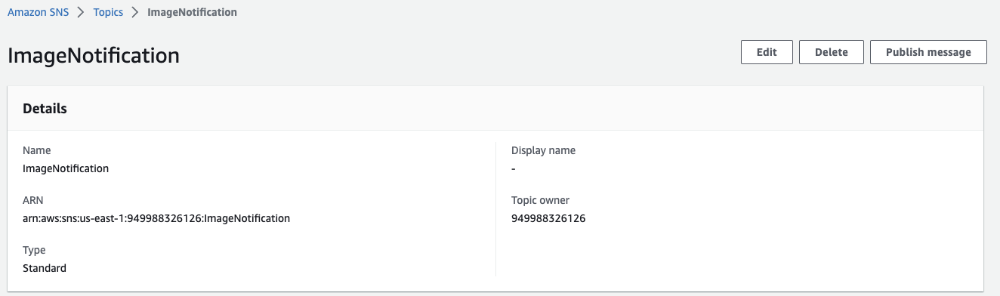
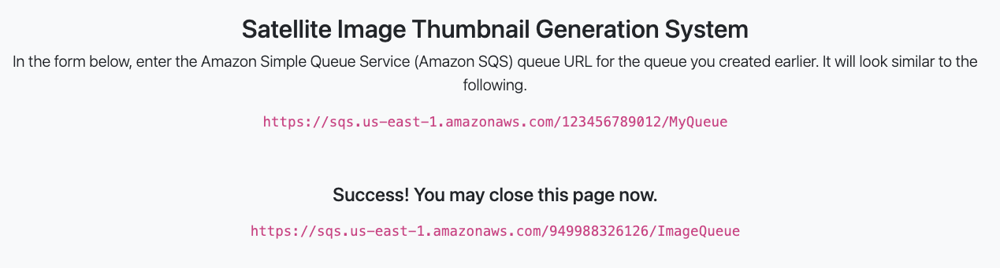
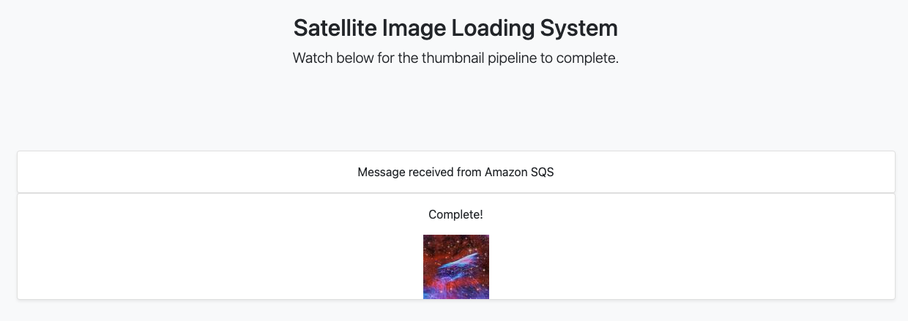
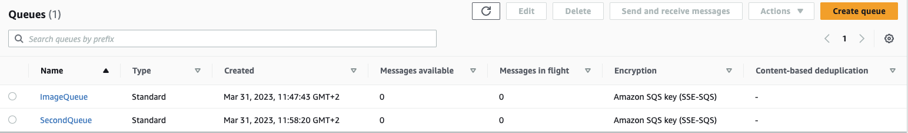
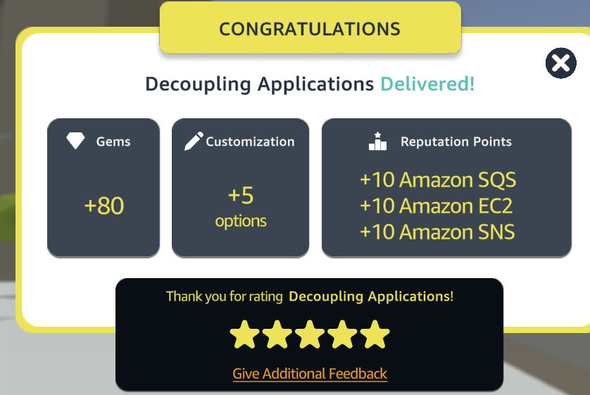

# Decoupling Application with Amazon SQS and SNS

[](https://docs.aws.amazon.com/quicksight/latest/user/signing-up.html)
[](https://aws.amazon.com/sns/)
[](https://aws.amazon.com/sqs/)


In this AWS quest, you will learn how to decouple your application using Amazon Simple Queue Service (SQS) and Amazon Simple Notification Service (SNS).
<p align="center">
  
</p>


## Table of Contents

- [Requirements](#requirements)
- [Steps](#Steps)
- [Conclusion](#conclusion)
- [Contributors](#contributors)


## Requirements
To complete this quest, you will need an AWS account with access to the following services:
- Amazon CloudFront
- Amazon EC2
- Amazon S3

## Steps
This quest consists of the following tasks :

- Create an Amazon SQS queue
- Create an Amazon SNS topic
- Subscribe the Amazon SQS queue to the Amazon SNS topic
- Create an additional SQS queue and subscribe it to your existing SNS topic

### Step 1: Create an Amazon SNS topic
The first step is to create an Amazon SNS topic. SNS is a fully managed pub/sub messaging service that enables the decoupling of microservices and distributed systems. Follow these steps:

1. Open the Amazon SNS
2. Click the "Create topic" button.
3. Set the topic name to "ImageNotification" and click "Create topic".

<p align="center">
  
</p>

### Step 2: Create an Amazon SQS queue
The next step is to create an Amazon SQS queue. An SQS queue is a message queue that enables decoupling and scaling of microservices, distributed systems, and serverless applications. Follow these steps:

1. Open the Amazon SQS
2. Click the "Create queue" button.
3. In the "Create New Queue" page, choose "Standard Queue" and click "Next".
4. Set the queue name to "ImageQueue" and click "Create Queue".
5. Add the advance access policy to the queue. 


``` json
{
  "Version": "2008-10-17",
  "Id": "__default_policy_ID",
  "Statement": [
    {
      "Sid": "__owner_statement",
      "Effect": "Allow",
      "Principal": {
        "AWS": "949988326126"
      },
      "Action": [
        "SQS:*"
      ],
      "Resource": "arn:aws:sqs:us-east-1:949988326126:ImageQueue"
    },{
    "Effect":"Allow",
    "Principal": {
        "Service": "sns.amazonaws.com"
    },
    "Action":"sqs:SendMessage",
    "Resource":"arn:aws:sqs:us-east-1:949988326126:ImageQueue",
    "Condition":{
        "ArnEquals":{
            "aws:SourceArn":"arn:aws:sns:us-east-1:949988326126:ImageNotification"
        }
    }
}
  ]
}
```


### Step 3: Subscribe the Amazon SQS queue to the Amazon SNS topic
Now, you will subscribe the Amazon SQS queue to the Amazon SNS topic. This will allow messages sent to the SNS topic to be delivered to the SQS queue. Follow these steps:

1. Open the Amazon SNS
2. Click the "Subscriptions" tab.
3. Click the "Create subscription" button.
4. Set the protocol to "Amazon SQS" and select the "MyQueue" queue that you created in Task 1.
5. Click "Create subscription".
6. Then go on ec2 and launch instance at this endpoint http://3.234.40.63/thumbnail  for to add an image in the queue..

<p align="center">
  
</p>

7. Then go on ec2 and launch instance at this endpoint http://18.214.44.204/loader  for to check the image was been add to the queue.

<p align="center">
  
</p>


### Step 4: Create an additional SQS queue and subscribe it to your existing SNS topic

Finally, you will create an additional Amazon SQS queue and subscribe it to your existing Amazon SNS topic. This will allow multiple SQS queues to receive messages sent to the same SNS topic. Follow these steps:

1. Open the Amazon SQS
2. Click the "Create queue" button.
3. In the "Create New Queue" page, choose "Standard Queue" and click "Next".
4. Set the queue name to "SecondQueue" and click "Create Queue".
5. Add the advance access policy to the queue. 


``` json

{
  "Version": "2008-10-17",
  "Id": "__default_policy_ID",
  "Statement": [
    {
      "Sid": "__owner_statement",
      "Effect": "Allow",
      "Principal": {
        "AWS": "949988326126"
      },
      "Action": [
        "SQS:*"
      ],
      "Resource": "arn:aws:sqs:us-east-1:949988326126:SecondQueue"
    },
    "Effect":"Allow",
    "Principal": {
        "Service": "sns.amazonaws.com"
    },
    "Action":"sqs:SendMessage",
    "Resource":"arn:aws:sqs:us-east-1:949988326126:SecondQueue",
    "Condition":{
        "ArnEquals":{
            "aws:SourceArn":"arn:aws:sns:us-east-1:949988326126:ImageNotification"
        }
    }
  ]
}
```

6. Click the "Subscriptions" tab.
7. Click the "Create subscription" button.
7. Set the protocol to "Amazon SQS" and select the "SecondQueue" queue that you created in step 4.
8. Select the "ImageTopic" topic that you created in Task 2.
9. Click "Create subscription".

<p align="center">
  
</p>

## Conclusion
The Decoupling Application quest of AWS is a valuable resource for developers looking to build highly scalable and decoupled applications. By learning how to create Amazon SQS queues, SNS topics, and subscriptions, developers can build resilient and fault-tolerant systems that can scale to meet increasing demand. The skills learned in this quest can be applied to a wide variety of use cases, from simple message queuing systems to complex distributed applications. With the knowledge gained from this quest, developers can create efficient and reliable applications that can adapt to changing business needs and user demands.
<p align="center">
  
</p>

## Contributors

[Daniele Bocchino](https://danielebocchino.github.io/)

[](https://github.com/DanieleBocchino)  
[](https://www.linkedin.com/in/daniele-bocchino-aa602a20b/)
