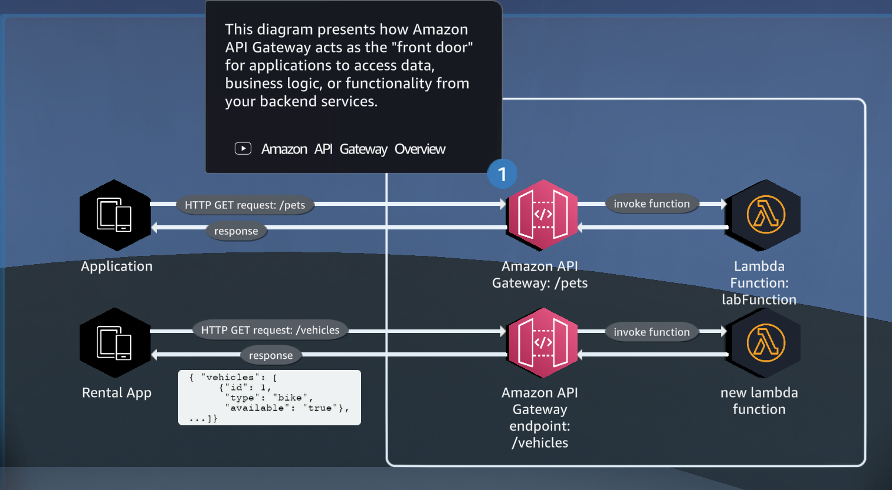
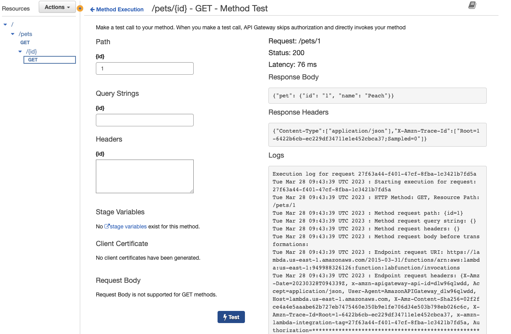
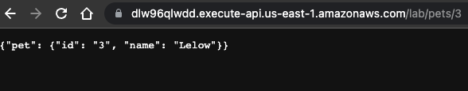
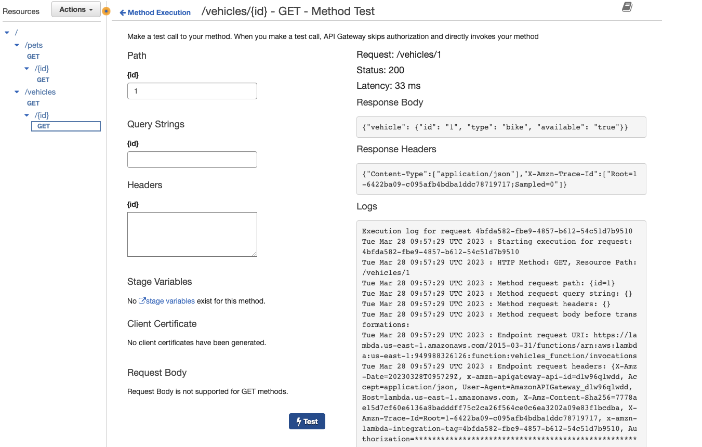
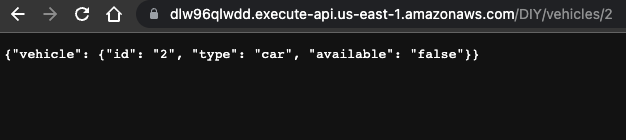
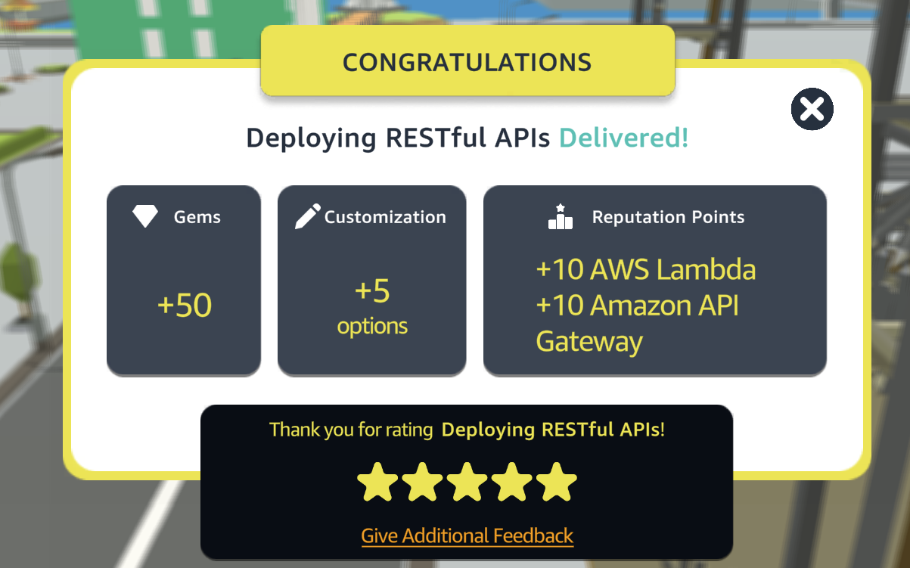

# AWS Deploying RESTful APIs

[](https://docs.aws.amazon.com/quicksight/latest/user/signing-up.html)
[](https://aws.amazon.com/route53/)
[](https://aws.amazon.com/ec2/)
[](https://aws.amazon.com/vpc/)


This quest will walk you through the steps of deploying a RESTful API using AWS Lambda and API Gateway. We will create a Lambda function that will be invoked by API Gateway, and configure API Gateway to serve our API.

<p align="center">
  
</p>

## Table of Contents

- [Requirements](#requirements)
- [Steps](#Steps)
- [Conclusion](#conclusion)
- [Contributors](#contributors)


## Requirements
To complete this quest, you will need an AWS account with access to the following services:
- Amazon Lambda Function
- Amazon API Gateway

##Steps
### Step 1: Creating a Lambda Function
1. Log in to your AWS Management Console.
2. From the list of services, select Lambda under the Compute section.
3. Click the Create Function button.
4. Select Author from scratch.
5. Provide a name for your function.
6. Select the runtime as Python 3.8.
7. Click the Create Function button.
8. In the Function code section, paste the following code:

``` python
import json
import logging

# AWS Lambda Function Logging in Python - https://docs.aws.amazon.com/lambda/latest/dg/python-logging.html
logger = logging.getLogger()
logger.setLevel(logging.INFO)

def lambda_handler(event, context):
    '''Demonstrates Amazon API Gateway Lambda proxy integration. You have full
    access to the request and response payload, including headers and
    status code.
    https://docs.aws.amazon.com/apigateway/latest/developerguide/set-up-lambda-proxy-integrations.html
    '''
    logger.debug(event) # Mind logger.setLevel at line 6. Check Event printed at CloudWatch

    #/pets/{petId}
    pets = [
        { "id": "1", "name": "Peach"},
        { "id": "2", "name": "Chuck"},
        { "id": "3", "name": "Lelow"}
    ]
    
    
    # Input Format https://docs.aws.amazon.com/apigateway/latest/developerguide/set-up-lambda-proxy-integrations.html#api-gateway-simple-proxy-for-lambda-input-format
    resource = event['resource']
    # Uncomment to print the event
    # print("Received event: " + json.dumps(event, indent=2))

    err = None
    # /pets List all pets
    response_body = {}
    if (resource == "/pets"):
        response_body = {
            "pets": pets
        }
    # /pets/petId find pet by Id    
    elif (resource == "/pets/{id}"):
        petId = event['pathParameters']['id']
        value = next((item for item in pets if item["id"] == str(petId)), False)
        if( value == False ):
            err = "Pet not found"
        else:
            response_body = {
                "pet": value
            }

        
    response =  response_payload(err, response_body)

    return response
  
  
    
'''
In Lambda proxy integration, API Gateway sends the entire request as input to a backend Lambda function. 
API Gateway then transforms the Lambda function output to a frontend HTTP response.
Output Format: https://docs.aws.amazon.com/apigateway/latest/developerguide/set-up-lambda-proxy-integrations.html#api-gateway-simple-proxy-for-lambda-output-format
'''
def response_payload(err, res=None):
    return {
        'statusCode': '400' if err else '200',
        'body': err if err else json.dumps(res),
        'headers': {
            'Content-Type': 'application/json',
        },
    }

```


### Step 2: Create an API Gateway REST API
1. Open the AWS Management Console and navigate to the API Gateway service.
2 .Click on "Create API".
3. Choose "REST API" and click "Build".
4. Choose "New API" and give your API a name.
5. Click "Create API".


### Step 3: Create a resource
1. Click on "Create Resource" and give your resource a name.
2. Click "Create Resource".
3. Click on "Create Method" and choose "GET".
4. Choose "Lambda Function" as the integration type and select your Lambda function.
5. Click "Save" and then "OK".

<p align="center">
  
</p>


### Step 4:  Deploy your API
1. Click on "Actions" and choose "Deploy API".
2. Choose "New Stage" and give your stage a name.
3. Click "Deploy".

<p align="center">
  
</p>

### Step 5:  DIY Challenge
Now create a new lambda function with this code :

``` python
import json
import logging

# AWS Lambda Function Logging in Python - https://docs.aws.amazon.com/lambda/latest/dg/python-logging.html
logger = logging.getLogger()
logger.setLevel(logging.INFO)

def lambda_handler(event, context):
    '''Demonstrates Amazon API Gateway Lambda proxy integration. You have full
    access to the request and response payload, including headers and
    status code.
    https://docs.aws.amazon.com/apigateway/latest/developerguide/set-up-lambda-proxy-integrations.html
    '''
    logger.debug(event) # Mind logger.setLevel at line 6. Check Event printed at CloudWatch

    #/vehicles/{vehicleId}
    vehicles = [
        { "id": "1", "type": "bike", "available":"true"},
        { "id": "2", "type": "car", "available":"false"},
        { "id": "3", "type": "truck", "available": "true"}
    ]
    
    
    # Input Format https://docs.aws.amazon.com/apigateway/latest/developerguide/set-up-lambda-proxy-integrations.html#api-gateway-simple-proxy-for-lambda-input-format
    resource = event['resource']
    # Uncomment to print the event
    # print("Received event: " + json.dumps(event, indent=2))

    err = None
    # /vehicles List all vehicles
    response_body = {}
    if (resource == "/vehicles"):
        response_body = {
            "vehicles": vehicles
        }
    # /vehicles/vehicleId find vehicle by Id    
    elif (resource == "/vehicles/{id}"):
        vehicleId = event['pathParameters']['id']
        value = next((item for item in vehicles if item["id"] == str(vehicleId)), False)
        if( value == False ):
            err = "vehicle not found"
        else:
            response_body = {
                "vehicle": value
            }

        
    response =  response_payload(err, response_body)

    return response
  
  
    
'''
In Lambda proxy integration, API Gateway sends the entire request as input to a backend Lambda function. 
API Gateway then transforms the Lambda function output to a frontend HTTP response.
Output Format: https://docs.aws.amazon.com/apigateway/latest/developerguide/set-up-lambda-proxy-integrations.html#api-gateway-simple-proxy-for-lambda-output-format
'''
def response_payload(err, res=None):
    return {
        'statusCode': '400' if err else '200',
        'body': err if err else json.dumps(res),
        'headers': {
            'Content-Type': 'application/json',
        },
    }
```


### Step 6: Create a resource about vehicles
1. Click on "Create Resource" and give your resource a name.
2. Click "Create Resource".
3. Click on "Create Method" and choose "GET".
4. Choose "Lambda Function" as the integration type and select your Lambda function.
5. Click "Save" and then "OK".

<p align="center">
  
</p>

### Step 7:  Deploy your API about vehicles
1. Click on "Actions" and choose "Deploy API".
2. Choose "New Stage" and give your stage a name.
3. Click "Deploy".

<p align="center">
  
</p>

## Conclusion
Congratulations! You have successfully deployed a RESTful API using AWS Lambda and API Gateway. You can now add more resources and methods to your API, and customize your integration with Lambda.

<p align="center">
  
</p>

## Contributors

[Daniele Bocchino](https://danielebocchino.github.io/)

[](https://github.com/DanieleBocchino)  
[](https://www.linkedin.com/in/daniele-bocchino-aa602a20b/)
