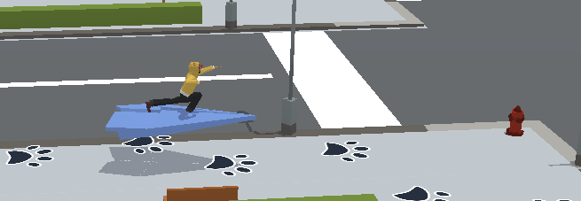

# AWS Cloud Quest: Solutions Architect 

AWS Cloud Quest, the role-playing game designed to help you build practical AWS Cloud skills. As a Solutions Architect, your goal is to dive into a broad set of AWS services and build secure, fault-tolerant, and highly available AWS solutions. This is a collection of challenges, solutions, and tips for the AWS Cloud Quest game, the only role-playing game designed to help you build practical AWS Cloud skills.

  

## 🚀 About AWS Cloud Quest
In AWS Cloud Quest, you choose your role from six options: Cloud Practitioner, Serverless Developer, Solutions Architect, Machine Learning Specialist, Security Specialist, or Data Analytics Specialist. Then, you learn and apply cloud skills to help the citizens of your virtual city. Each role has a set of assignments that you must complete to earn a digital badge and showcase your achievement.

As a Solutions Architect, you will dive into a broad set of AWS services and build secure, fault-tolerant, and highly available AWS solutions. This role is ideal for those who want to learn how to design and deploy scalable, reliable, and cost-effective applications on AWS.

  

## 📑  About this Repository
This repository is a resource for anyone who wants to improve their Solutions Architect skills in AWS Cloud Quest. Here, you will find a set of challenges that simulate real-world scenarios and require you to use AWS services to solve them. Each challenge includes a problem statement, a set of requirements, and a solution that you can use as a reference.

In addition, this repository includes a set of tips and best practices for Solutions Architects, as well as links to additional resources and documentation. Whether you are new to AWS or an experienced Solutions Architect, this repository will help you sharpen your skills and prepare for the AWS Certified exam.

  

## 🧑🏻‍💻 How to Use this Repository
To get started with AWS Cloud Quest Challenge Repository, you should first clone the repository to your local machine. Then, you can navigate to the Solutions Architect folder and start working on the challenges. Each challenge is organized in a separate folder and includes a README file with detailed instructions.

As you work on the challenges, you can use the provided solutions as a reference and compare your approach with the recommended best practices. You can also contribute to the repository by submitting new challenges or improvements to existing ones.

## 🏅 Certificates 
AWS Cloud Quest is a fun and engaging way to learn AWS Cloud skills, and this repository will help you master the Solutions Architect role. We hope you enjoy playing the game and using this repository, and we welcome your feedback and contributions.

  
  

## Contributors

[Daniele Bocchino](https://danielebocchino.github.io/)

  

