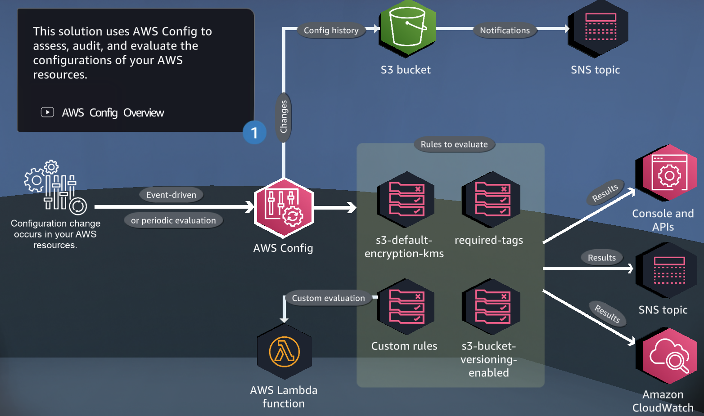
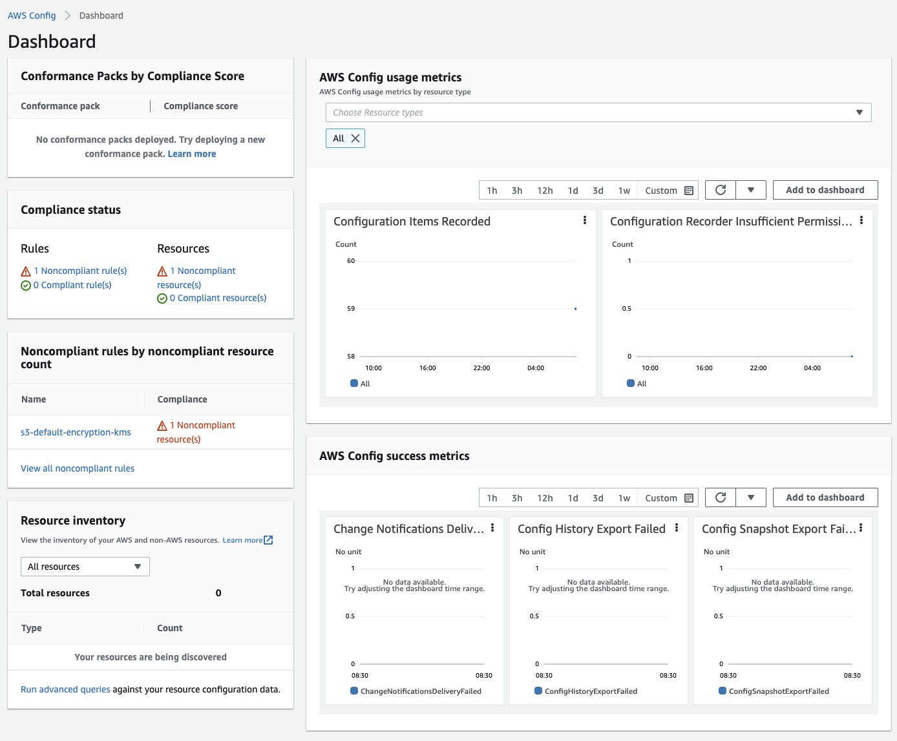
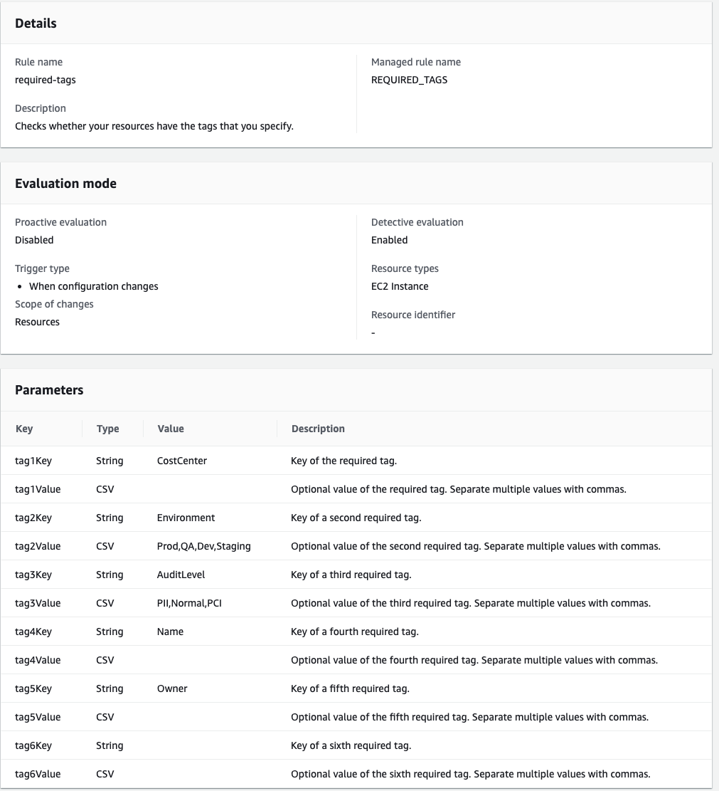
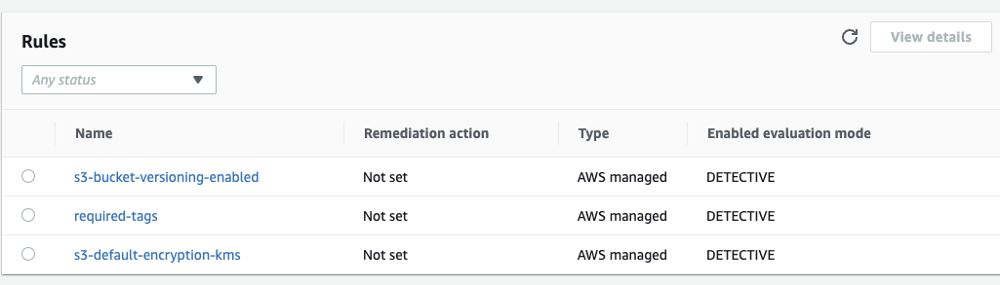
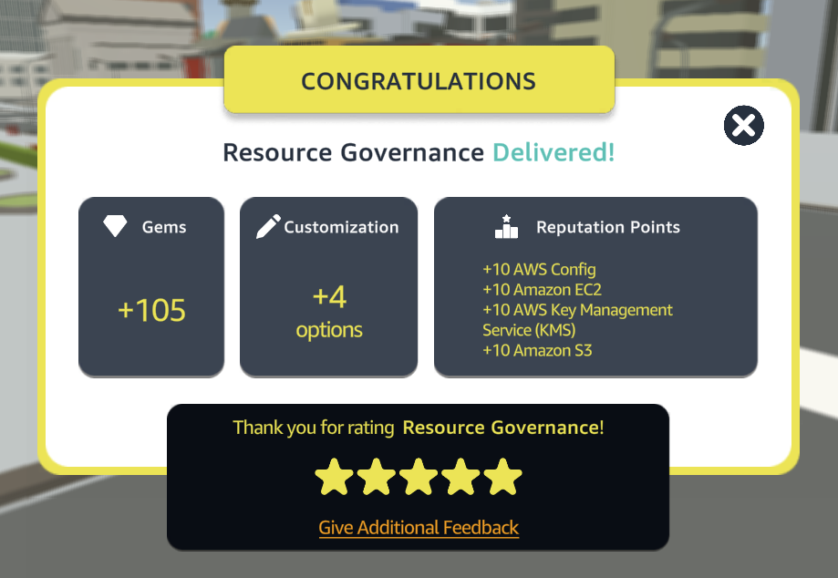

# Resources Governance

This AWS Cloud Quest focuses on configuring AWS Config managed rules for S3 KMS encryption, tagged resources, and S3 bucket versioning. The following are the steps to complete this quest.

  

## Table of Contents

- [Requirements](#requirements)
- [Steps](#Steps)
- [Conclusion](#conclusion)
- [Contributors](#contributors)

## Requirements
To complete this quest, you will need an AWS account with access to the following services:
- Amazon Cloud Config
- Amazon EC2
- Amazon S3

## Steps
### Step 1: Create an AWS Config Managed Rule for S3 KMS Encryption
In this step, you need to create an AWS Config managed rule that verifies that all S3 buckets in your account are encrypted using KMS. To create this rule, follow the below steps::

1. Open the AWS Config console and choose "Managed rules".
2. Choose "Add rule".
3. Select the AWS managed rule "s3-bucket-server-side-encryption-by-default".
4. Choose the "AWS Config managed" option for remediation.
5. Review the rule and choose "Add rule".
6. Check compliance status and noncompliant rules on AWS Config Dashboard

  

### Step 2: Configure an AWS Config Managed Rule for Tagged Resources
In this step, you need to create an AWS Config managed rule that verifies that all resources in your account are tagged with a specific tag. To create this rule, follow the below steps:

1. Open the AWS Config console and choose "Managed rules".
2. Choose "Add rule".
3. Select the AWS managed rule "required-tags".
4. Choose the "AWS Config managed" option for remediation.
5. Specify the tag key and value that you want to use for the rule.
6. Review the rule and choose "Add rule".

  

### Step 3: Configure an AWS Config Managed Rule for S3 Bucket Versioning
In this step, you need to create an AWS Config managed rule that verifies that all S3 buckets in your account have versioning enabled. To create this rule, follow the below steps:

1. Open the AWS Config console and choose "Managed rules".
2. Choose "Add rule".
3. Select the AWS managed rule "s3-bucket-versioning-enabled".
4. Choose the "AWS Config managed" option for remediation.
5. Review the rule and choose "Add rule".
6. Check compliance status and noncompliant rules on AWS Config Dashboard

  

By completing the above steps, you will have successfully configured AWS Config managed rules for S3 KMS encryption, tagged resources, and S3 bucket versioning.

## Conclusion
This AWS quest has taught us how to effectively govern our AWS resources by implementing several managed rules using AWS Config. By setting up rules for S3 KMS encryption, resource tagging, and S3 bucket versioning, we have increased the security and compliance of our resources while also ensuring that they are properly configured and easily managed. With AWS Config, we can easily monitor our resources and take action when necessary to maintain a secure and well-governed AWS environment.

  

## Contributors

[Daniele Bocchino](https://danielebocchino.github.io/)

  

