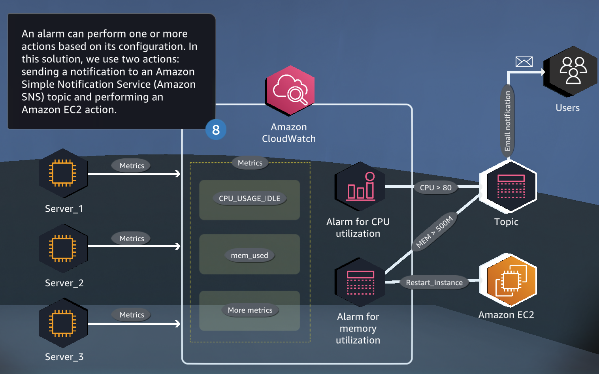
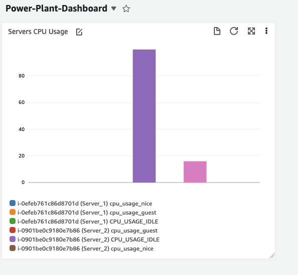
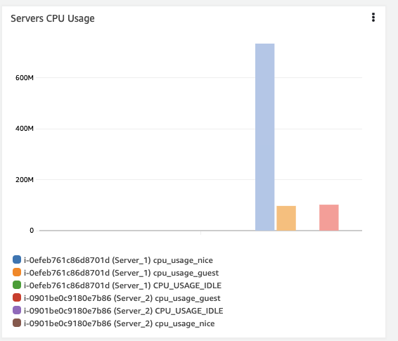
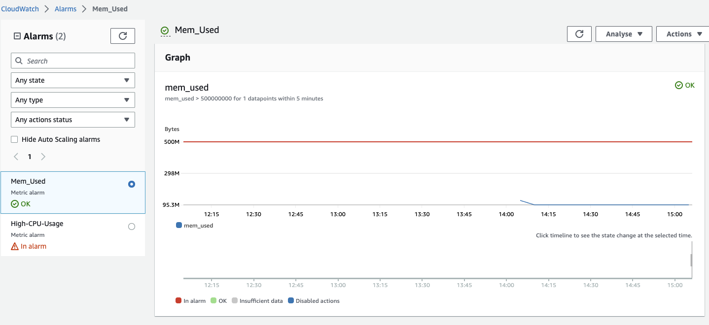
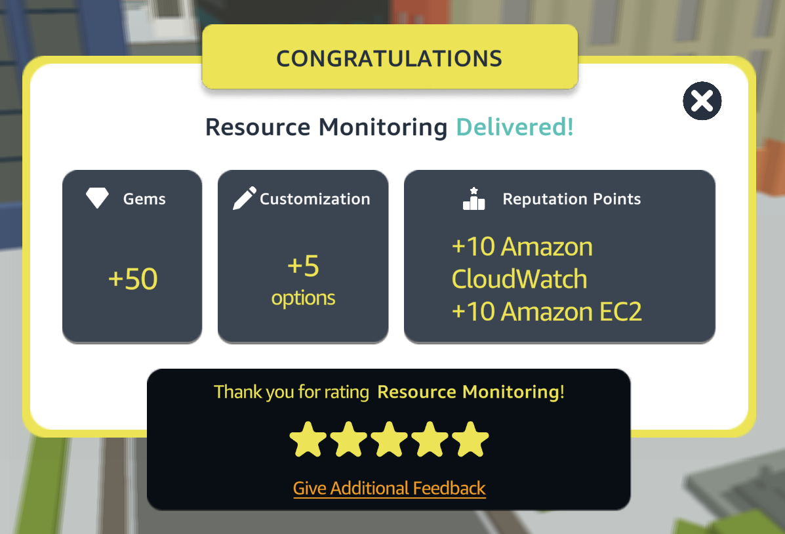

# Resources Monitoring with Amazon CloudWatch

This repository contains information and code related to monitoring AWS resources using CloudWatch metrics, configuring CloudWatch alarms and actions, and setting up an Amazon CloudWatch dashboard.

  

## Table of Contents

- [Requirements](#requirements)
- [Steps](#Steps)
- [Conclusion](#conclusion)
- [Contributors](#contributors)

## Requirements
To complete this quest, you will need an AWS account with access to the following services:
- Amazon CloudWatch
- Amazon EC2

## Steps
### Step 1: Create a Dashboard for CPU Usage
The first step is to create a dashboard to monitor CPU usage. Here are the steps to follow:

1. Open the CloudWatch console.
2. In the navigation pane, click on Dashboards.
3. Click on Create dashboard.
4. Enter a name for your dashboard and click on Create dashboard.
5. Click on Add widget and select Line.
6. In the Configure widget screen, select the EC2 namespace, the CPUUtilization metric, and the Average statistic.
7. Choose the instance you want to monitor and click on Create widget.
8. You can add more widgets to your dashboard by clicking on Add widget and selecting the desired metrics.

  

### Step 2: Set up an Alarm
The second step is to set up an alarm for CPU usage. Here are the steps to follow:

1. In the CloudWatch console, select the dashboard you just created.
2. Click on the widget you want to create an alarm for.
3. Click on the bell icon to create a new alarm.
4. In the Create Alarm screen, configure the alarm threshold, the actions to take when the alarm is triggered, and the notification settings.
5. Click on Create Alarm to save the alarm.

### Step 3: Add Memory Usage to the Dashboard
The next step is to add memory usage to the dashboard. Here are the steps to follow:

1. Click on the dashboard you created earlier.
2. Click on Add widget and select Line.
3. In the Configure widget screen, select the EC2 namespace, the MemoryUtilization metric, and the Average statistic.
4. Choose the instance you want to monitor and click on Create widget.
5. You can add more widgets to your dashboard by clicking on Add widget and selecting the desired metrics.

  

### Step 4: Create an Alarm for Memory Usage
The final step is to create an alarm for memory usage. Here are the steps to follow:

1. In the CloudWatch console, select the dashboard you just updated.
2. Click on the widget you want to create an alarm for.
3. Click on the bell icon to create a new alarm.
4. In the Create Alarm screen, configure the alarm threshold, the actions to take when the alarm is triggered, and the notification settings.
5. Click on Create Alarm to save the alarm.

  

## Conclusion
In conclusion, backing up your data is essential to ensure its safety and continuity in the event of an unexpected event. AWS provides multiple solutions for backing up your data, including creating a custom backup vault, configuring automated backup plans, and using tags to manage resources. With the knowledge gained from this guide, you can now confidently create and manage backup solutions for your AWS resources, ensuring that your data is always protected and available. Remember to regularly review and test your backup plans to ensure their effectiveness and make any necessary adjustments.

  

## Contributors

[Daniele Bocchino](https://danielebocchino.github.io/)

  

