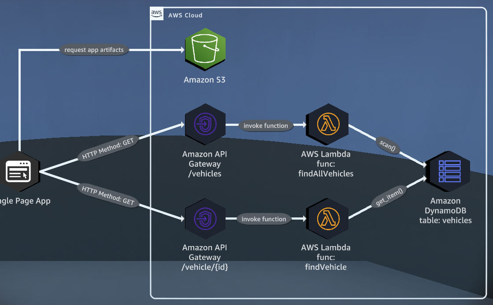
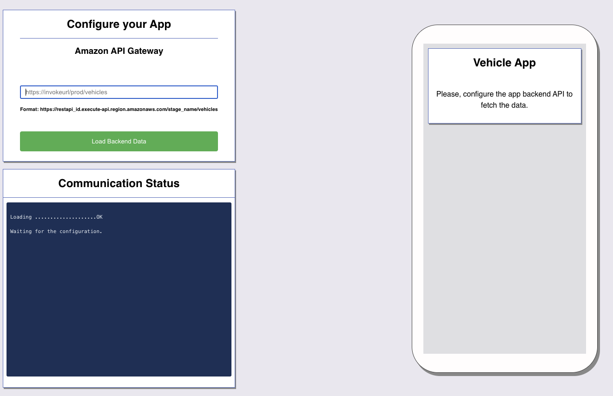
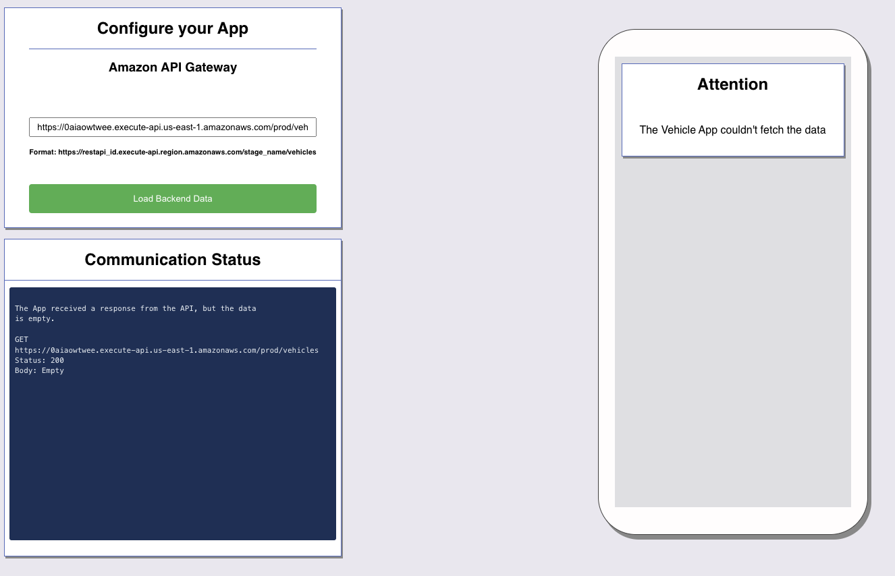
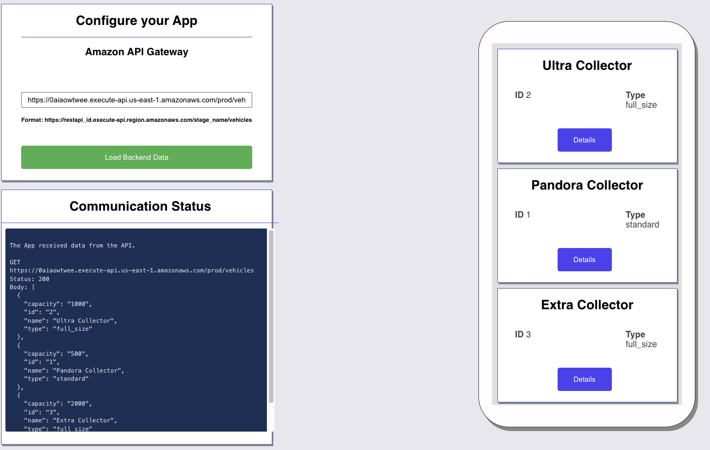
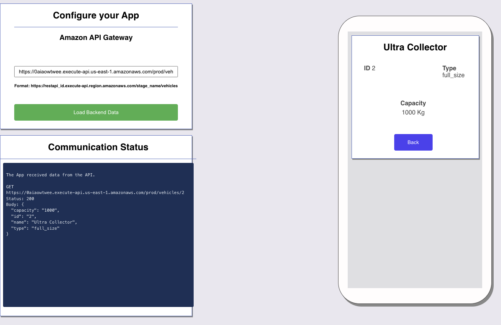
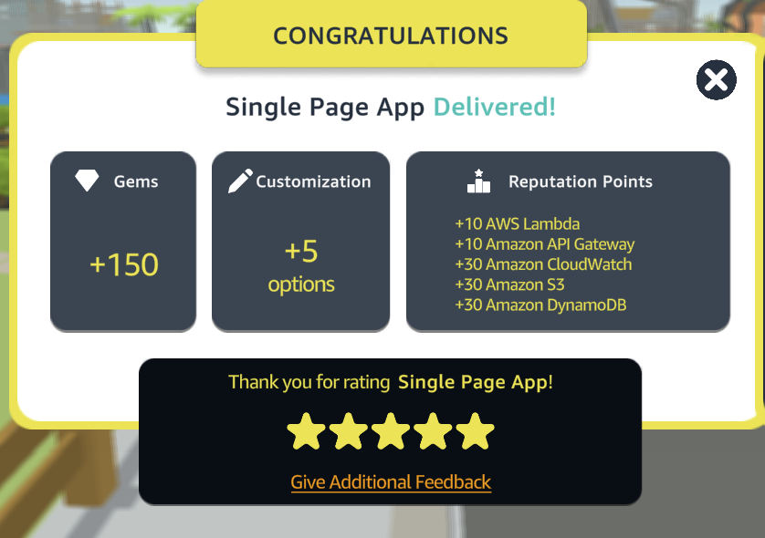

# Single Page App

{{AWS}}
{{DynamoDB}}
{{API Gateway}}
{{S3}}

## OVERVIEW

This is a practice lab designed to help you learn how to configure Amazon S3 to host a single page application, locate the Amazon API Gateway invoke URL, and troubleshoot resource connections from Amazon API Gateway to Amazon DynamoDB.

<p align="center">
  
</p>

## Table of Contents

- [Requirements](#requirements)
- [Steps](#Steps)
- [Conclusion](#conclusion)
- [Contributors](#contributors)

<p align="center">
  
</p>

## Requirements

To complete this quest, you will need an AWS account with access to the following services:

- Amazon DynamoDB
- Amazon Lambda
- Amazon S3
- Amazon API Gateway

## Steps

This quest consists of the following steps:

- Set up an Amazon EC2 instance as an origin for a CloudFront distribution.
- Configure an Amazon S3 hosted website as an origin for a CloudFront distribution.
- Reconfigure a CloudFront distribution to use an Amazon S3 website as the origin with index.html as the main page.

### Step 1: Set up an Amazon S3 policy

Go to the AWS S3 console and attach the following policy to your S3 bucket:


```json

{
    "Version": "2012-10-17",
    "Statement": [
        {
            "Sid": "PublicReadGetObject",
            "Effect": "Allow",
            "Principal": "*",
            "Action": "s3:GetObject",
            "Resource": "arn:aws:s3:::BUCKET_NAME/*"
        }
    ]
}
```

### Step 2: Edit your static web hosting settings and launch your website.

1. Create an S3 bucket to host a static website
2. Configure the bucket policy to allow public read access
3. Upload the website files to the S3 bucket
4. Configure the bucket properties to enable static website hosting

<p align="center">
  
</p>


Go to the AWS API Gateway console and copy the "prod" link: https://0aiaowtwee.execute-api.us-east-1.amazonaws.com/prod

### Step 3: Paste the copied "prod" link into your application.

<p align="center">
  
</p>

### Step 3: Reconfigure your Lambda function to read the element from the API call.

<p align="center">
  
</p>


## Conclusion
In conclusion, this README provides a step-by-step guide for configuring an AWS serverless web application using S3, API Gateway, and Lambda. By following these instructions, users can create a scalable, low-cost web application that can handle a variety of tasks. This project also demonstrates how to use AWS services together to create a functional application. Overall, with these instructions, even those with minimal experience using AWS can create a fully functional serverless web application.

<p align="center">
  
</p>

## Contributors

[Daniele Bocchino](https://danielebocchino.github.io/)

[](https://github.com/DanieleBocchino)
[](https://www.linkedin.com/in/daniele-bocchino-aa602a20b/)
